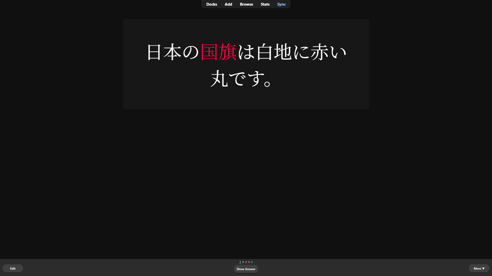
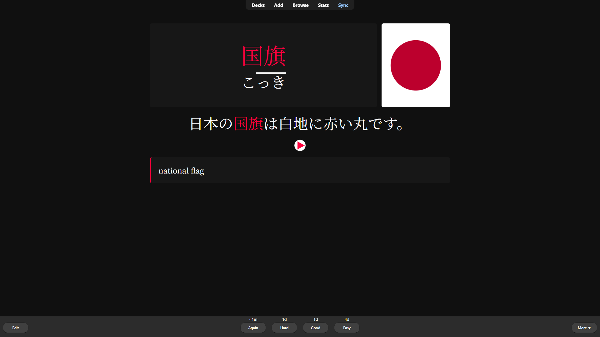
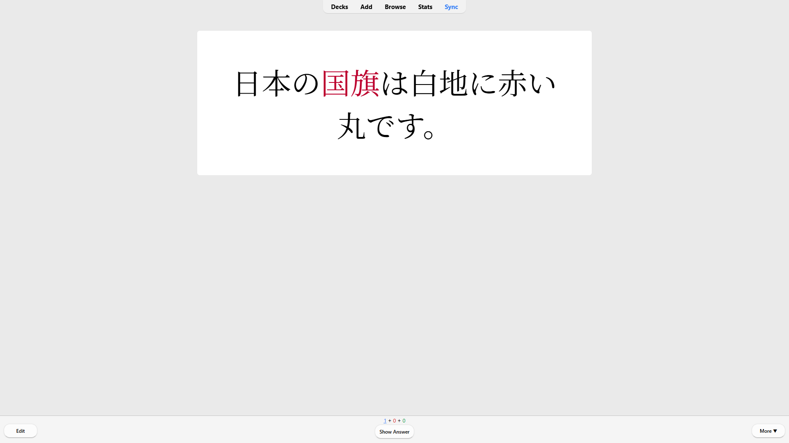
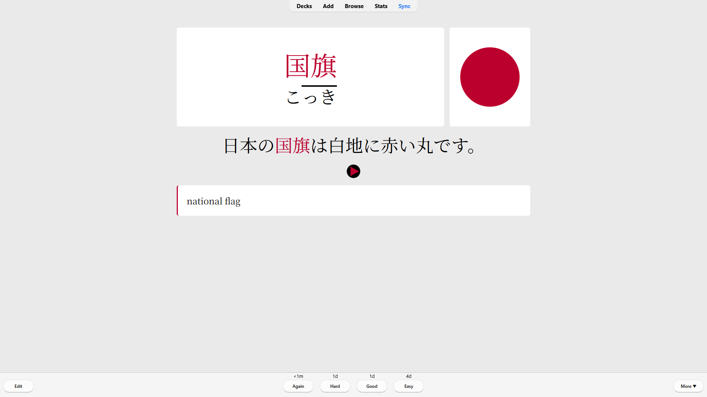

# About Kokki
Kokki is a simple Anki note type for mining japanese sentences. Its code is kept short and easily modifiable.

# Why I made this note type
Most other note types feature code for every customization setting a user may pick. This allows the card to be customized with only the fields or the user interface of the card.

Sadly, this comes at the cost of a large code size and field list. This makes it difficult to edit the code.

I've chosen the opposite approach with Kokki, the code and fields are kept very simple so you can customize it with only a vague knowledge of HTML and CSS if ever needed.

# Features
By default Kokki is intended for targeted sentence mining.
This means that the front always feature a sentence which highlights the targeted expression inside it.

A short JavaScript script highlights occurences of the expression inside the sentence.

If the expression has a different form than the one found inside the sentence, it won't be recognized and thus won't be highlighted.  
You can make the expression **bold** inside the sentence to achieve the same effect.
This usually happens with verb conjugations. (する won't be recognized if した is used in the sentence for example).

If you prefer expression/word cards, you can easily replace the line which contains {{Sentence}} by {{Expression}} on the front card.

By default Kokki features 7 fields:
- Expression: Expression/word you work on. This is the sort field (The field Anki uses to identify a note and check if it has duplicates)
- PitchAccent: Variations of the pitch when pronouncing the expression
- Sentence: The sentence in which you found the expression
- Definition: Definition or translation of the expression
- Audio: Audio of the sentence you listened to
- Image: An Image can be more efficient than a definition, especially with common nouns
- Frequency: How common the expression is

# Credits
The card type inspired by [Tatsumoto Ren's AJATT methodology](https://tatsumoto-ren.github.io/blog/sentence-mining.html)  
The card layout is inspired by the [Lapis](https://github.com/donkuri/lapis) node type  
The colors are inspired by the flag of Japan 🇯🇵, hence the name :)

# Screenshots

